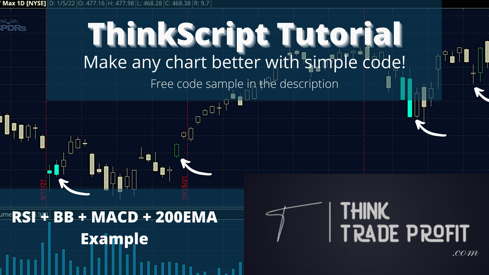

_In today&#39;s tutorial, we will learn how to make a chart significantly more readable by adding colored bars associated with different conditions – Overbought, Oversold, and Middle Line Crossovers for entry signals. This example will use the Bollinger Bands and RSI for reversal signals, the MACD and Middle Line of the Bollinger Bands for trend-following entry signals, and a 200-period Exponential Moving Average (EMA) to filter out counter-trend signals._

# Imagine this simple strategy....

We want to trade with the trend of the 200-period EMA. We are using the RSI and Bollinger Bands for reversal signals and the MACD and Bollinger Bands Middle-line for entry signals.

- **In an UPTREND...**
  - We look for long trades when the **RSI is oversold** _and_ **price closes BELOW the Lower Bollinger Band**.
  - We take long trades when **price crosses ABOVE the Middle Line of the Bollinger Bands** _and_ **the MACD Line is ABOVE the Signal Line**.

- **In a DOWNTREND...**
  - We look for short trades when the **RSI is overbought** _and_ **price closes ABOVE the Upper Bollinger Band**.
  - We take short trades when **price crosses BELOW the Middle Line of the Bollinger Bands** _and_ **the MACD Line is BELOW the Signal Line**.

Even a simple strategy like this can be hard to read on the chart in real-time. And we all know, time is money – _especially for traders._.

Below are two charts of the SPDR S&amp;P 5000 ETF Trust (Ticker: SPY) both using the same strategy and covering the same timeframes. (Screenshots directly from ThinkOrSwim Platform).

Be honest... Which one do you think is easier to read, back-test, and execute?

Uptrend Example

Downtrend Example

The chart on the right is the hands down winner. Referring back to our strategy:

- **In an UPTREND...**
  - RSI OverSold + Close below Lower BB = **Light Blue Candle**
  - BB MidLine Cross Up + Positive MACD = **Green Candle**

- **In a DOWNTREND...**
  - RSI Overbought + Close above Upper BB = **Red Candle**
  - BB Midline Cross Down + Negative MACD = **Pink Candle**

_When we have no signal, the candles are gray. We know we can move on to the next chat in our watchlist._

With these simple color=codes. Every rule of our strategy is represented clearly at a glance. There is less temptation to jump into trades too early, and it is easy even for the newest trader to follow te strategy clearly.

# But making this chart must be hard.... Right?

In fact, it&#39;s incredibly simple! A little copy/paste is enough to get started, and from there, there are only a couple of lines of code. Let&#39;s get into it!

Let&#39;s start with come basic code: [http://tos.mx/dhFH0LN](http://tos.mx/dhFH0LN)

The above link will allow you to directly download the starting code, which includes all 4 of our indicators. Here&#39;s a breakdown of the code:

#MACD inputs

input fastlength = 9;

input slowlength = 26;

input MACDlength = 12;

#RSI inputs

input RSILength = 6;

input RSIaveragetype = AverageType.WILDERS;

input RSIprice = close;

input RSIOverbought = 70;

input RSIOversold = 30;

#Collinger Bands Inputs

input BBLength = 20;

input STDUp = 2.0;

input STDdown = -2.0;

input BBAverageType = AverageType.SIMPLE;

input BBprice = hlc3;

#200-period EMA inputs

input filterlength = 200;

input filterprice = close;

input filteraveragetype = AverageType.EXPONENTIAL;

input usefilter = yes;

input showlines = yes;

def Value = MACD(fastlength, slowlength, MACDlength).value; #This is the MACD Line

def AVg = MACD(fastlength, slowlength, MACDlength).Avg; # This is the Signal Line

def Diff = MACD(fastlength, slowlength, MACDlength).Diff;#This is the MACD Histogram

def RSI = RSI(price = RSIprice, length = RSILength, averagetype = RSIaveragetype); #This is the RSI

plot Midline = MovingAverage(BBAverageType, BBprice, BBLength); #This is the Middle Line of Bollinger Bands

plot Lowerline = Midline + StDev(BBprice, BBLength) \* STDdown; #The Lower Bollinger Band

plot Upperline = Midline + StDev(BBprice, BBLength) \* STDUp; #The Upper BollingerBands Band

plot filterline = if usefilter then MovingAverage(filteraveragetype, filterprice, filterlength) else 0; #Here is the 200-period EMA

All you need to do is save the study and you should have this output:

TICKER: SPY | Daily Chart, Sept. 2021 – Jan 2022. 

The Bollinger Bands and 200-period EMA are now on our chart! ...But what about the RSI and MACD?

In ThinkScript, lines that start with &quot;plot&quot; will add a line on the chart. For example, the line below:

**plot Lowerline = Midline + StDev(BBprice, BBLength) \* STDdown; #The Lower Bollinger Band**

This line is telling the indicator to plot the Lower Bollinger Bands line on the chart.

However, if we use the first word &quot;def&quot;, we are just telling ThinkOrSwim to save that data for us to use later - nothing will plot on the chart. For example, this line:

**def RSI = RSI(price = RSIprice, length = RSILength, averagetype = RSIaveragetype); #This is the RSI**

This is telling ThinkOrSwim to keep the value of the RSI for us, but not to put it on the chart.

By using the &quot;def&quot; and &quot;plot&quot; keywords, we can easily control how our indicators look, while also storing data for calculations!

# Now, let&#39;s get to the colors!

The first thing that we need to do is define the color rules. Look at the following line of code:

**def BBRSIlow = close \&lt; LowerLine and RSI \&lt; RSIoversold and close \&gt; filterline;**

Here, we&#39;ve made a new data variable called BBRSIlow, which checks three conditions:

1. **close \&lt; LowerLine** - The close is below the Lower Bollinger Band Line.
2. **RSI \&lt; RSIoversold** - The RSI is below the Oversold line.
3. **close \&gt; filterline** - The close is above the 200-period EMA.

When all three conditions are met, BBRSIlow will be _true_, otherwise it will be _false._

_...But how is this useful?_

##

# We can use True/False rules to change the price color!

#

All we need to do is use the &quot;AssignPriceColor&quot; function and use a basic &quot;if.... then … else&quot; logic.

_**AssignPriceColor(if BBRSIlow then color.cyan else color.gray);**_

This line is saying the following:

-IF the BBRSIlow conditions are TRUE for this candle, THEN we will give it a cyan (light blue) color.

-Or ELSE if BBRSIlow conditions are FALSE, we will color the canle gray.

_Try it for yourself! Copy and paste the two lines of code at the bottom of your indicator!_

def BBRSIlow = close \&lt; LowerLine and RSI \&lt; RSIoversold and close \&gt; filterline;

AssignPriceColor(if BBRSIlow then color.cyan else color.gray);

Once you save, you will have an output that looks like this:

TICKER: SPY | Daily Chart, Sept. 2021 – Jan 2022.

## Good work! You have your first colored bars!

Now let&#39;s repeat the steps for the other conditions.

_Check for RSI overbought, close above the Upper Bollinger Band and close below 200 EMA._

**def BBRSIhigh = close \&gt; UpperLine and RSI \&gt; RSIoverbought and close \&lt; filterline;**

Check for positive MACD Histogram, cross above the Middle Line, and close above 200EMA.

**def longentry = Diff\&gt;0 and close crosses above midline and close\&gt; filterline;**

Check for negative MACD Histogram, cross below the Middle Line, and close below 200EMA

**def shortentry = Diff \&lt; 0 and close crosses below midline and close\&lt; filterline;**

After that, we can edit our &quot;AssignPriceColor&quot; for each of the conditions.

**AssignPriceColor(if BBRSIlow then color.cyan else if BBRSIhigh then color.red else if longentry then color.green else if shortentry then color.pink else color.gray);**

So all of our code should now look like this:

#MACD inputs

input fastlength = 9;

input slowlength = 26;

input MACDlength = 12;

#RSI inputs

input RSILength = 6;

input RSIaveragetype = AverageType.WILDERS;

input RSIprice = close;

input RSIOverbought = 70;

input RSIOversold = 30;

#Collinger Bands Inputs

input BBLength = 20;

input STDUp = 2.0;

input STDdown = -2.0;

input BBAverageType = AverageType.SIMPLE;

input BBprice = hlc3;

#200-period EMA inputs

input filterlength = 200;

input filterprice = close;

input filteraveragetype = AverageType.EXPONENTIAL;

input usefilter = yes;

input showlines = yes;

def Value = MACD(fastlength, slowlength, MACDlength).value; #This is the MACD Line

def AVg = MACD(fastlength, slowlength, MACDlength).Avg; # This is the Signal Line

def Diff = MACD(fastlength, slowlength, MACDlength).Diff;#This is the MACD Histogram

def RSI = RSI(price = RSIprice, length = RSILength, averagetype = RSIaveragetype); #This is the RSI

plot Midline = MovingAverage(BBAverageType, BBprice, BBLength); #This is the Middle Line of Bollinger Bands

plot Lowerline = Midline + StDev(BBprice, BBLength) \* STDdown; #The Lower Bollinger Band

plot Upperline = Midline + StDev(BBprice, BBLength) \* STDUp; #The Upper BollingerBands Band

plot filterline = if usefilter then MovingAverage(filteraveragetype, filterprice, filterlength) else 0; #Here is the 200-period EMA

def BBRSIlow = close \&lt; LowerLine and RSI \&lt; RSIoversold and close \&gt; filterline;

def BBRSIhigh = close \&gt; UpperLine and RSI \&gt; RSIoverbought and close \&lt; filterline;

def longentry = Diff\&gt;0 and close crosses above midline and close\&gt; filterline;

def shortentry = Diff \&lt; 0 and close crosses below midline and close\&lt; filterline;

AssignPriceColor(if BBRSIlow then color.cyan else if BBRSIhigh then color.red else if longentry then color.green else if shortentry then color.pink else color.gray);

If you save this data, your chart should now look like this on the SPY.

TICKER: SPY | 1m Chart, Dec. 30,2021 | Shows all of our colored bars nicely 

There we have it! Colored bars that show us all of our strategy rules in a simple way! We COULD leave this right here and call it a day.

## One last thing we might want to do...

##

Let&#39;s get rid of the lines on the chart. Less clutter, and they aren&#39;t really needed any longer. On the top section of our code, we have an &quot;input&quot; like this:

**input showlines = yes;**

Let&#39;s use this to turn the lines off and on as we please!

_But wait... It doesn&#39;t work!_

**That&#39;s because inputs don&#39;t do anything until we do a calculation with them.**

So let&#39;s write some simple code to make it work. Let&#39;s add four lines at the bottom of our code.

_**Midline.sethiding(!showlines);**_

_**UpperLine.sethiding(!showlines);**_

_**Lowerline.sethiding(!showlines);**_

_**filterline.sethiding(!showlines);**_

_Here, we are using the built-in &quot;SetHiding&quot; feature. This lets us use an &quot;input&quot; to change whether a line is plotted on the chart or hidden. In this case, an exclamation mark (!) means &quot;not&quot;. So the logic is:_

_If showlines is NOT YES, HIDE the line._

_Let&#39;s save those lines, then open the &quot;Properties&quot; of our indicator. Try setting showlines to &quot;no&quot;. Your chart should now look like this:_

TICKER: SPY | Daily Chart, Sept. 2021 – Jan 2022.

# You&#39;ve done it! Four indicators combined together into simpler colored bars!

_But one challenge remains! There is an input called &quot;usefilter&quot; that we never used in our code. This one is meant to switch our filter line on and off. Can you figure out how to do it? Hint – you can use the &quot;if... then....else&quot; structure to change the BBRSIlow, BBRSIhigh, longentry, and shortentry. Final code will be posted next week!_

_I hope you enjoyed this tutorial. If you would like to watch a video of the steps, it can be found below!_